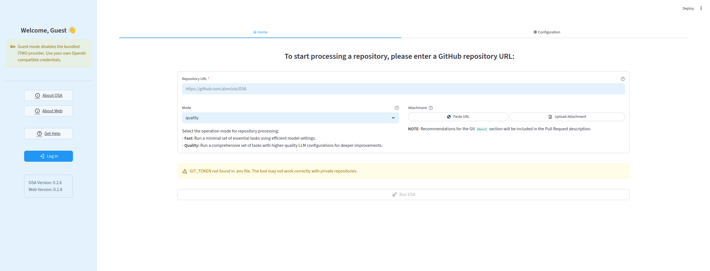
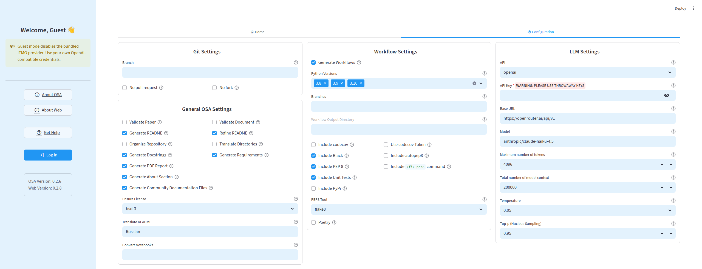

# OSA.Web: Open-Source Advisor Web Interface

<p align="center">


</p>

<p align="center">

## Overview

OSA.Web is a Streamlit interface for running [`osa-tool`](https://github.com/aimclub/OSA) against GitHub repositories. It lets a user type in a repository, tune OSA options, attach supporting documents, run the CLI, and download generated reports from the browser.

__Home Page:__



__Configuration Page:__



## Features

- AimClub login or guest mode.
- Fast and quality presets for OSA runs.
- Git, README, documentation, workflow, and LLM settings from the UI.
- Optional PDF or DOCX attachment upload.
- Live console output while `osa-tool` runs.
- Download buttons for generated PDF reports.
- Pull request and GitHub About-section feedback when available.

## Installation

```bash
python -m venv .venv
source .venv/bin/activate
pip install -r requirements.txt
```

For development tooling:

```bash
pip install -e ".[dev]"
```

## Configuration

Tracked defaults live in `config/default.toml`.

For local machine settings, copy the example file and edit it:

```bash
cp config/local.example.toml config/local.toml
```

`config/local.toml` is ignored by git. The app also still reads the legacy root `config.toml` for backward compatibility, so existing deployments keep working during the migration.

Configuration precedence:

1. `config/default.toml`
2. root `config.toml`, if present
3. `config/local.toml`, if present
4. `OSA_WEB_CONFIG`, if set

## Secrets

Create a local `.env` file when you need credentials:

```bash
cp .env.example .env
```

Supported variables:

- `GIT_TOKEN`: optional GitHub token for private repositories and pull request creation.
- `OSA_WEB_CONFIG`: optional path to a TOML config override.

Do not commit `.env` or real API keys.

## Project Structure

```text
.
├── config/
│   ├── default.toml          # tracked defaults
│   └── local.example.toml    # template for local overrides
├── Dockerfile                # container image definition
├── .dockerignore             # Docker build context exclusions
├── src/osa_web/
│   ├── app.py                # Streamlit app composition
│   ├── settings.py           # config loading and path resolution
│   ├── auth/                 # login and auth state
│   ├── ui/                   # Streamlit screens and widgets
│   ├── osa_tool/             # CLI command, runner, and output parser
│   ├── state/                # session-state helpers
│   └── assets/               # packaged static assets
├── tests/
│   └── unit/                 # pure unit tests
├── streamlit_app.py          # compatibility entrypoint
└── requirements.txt
```

## Running

```bash
streamlit run streamlit_app.py
```

The compatibility entrypoint adds `src/` to `sys.path` and calls `osa_web.app.main()`.

## Running With Docker

Build the image:

```bash
docker build -t osa-web .
```

Run the app:

```bash
docker run --rm -p 8501:8501 --env-file .env osa-web
```

Then open <http://localhost:8501>.

If you do not need credentials or do not have a local `.env` file, omit `--env-file .env`.

The Docker build intentionally excludes the legacy root `config.toml`, because that file is commonly used for machine-specific absolute paths. The container uses `config/default.toml` by default.

To provide container-specific settings, mount a local override:

```bash
docker run --rm \
  -p 8501:8501 \
  --env-file .env \
  -v "$PWD/config/local.toml:/app/config/local.toml:ro" \
  osa-web
```

To persist generated reports and logs between container runs:

```bash
docker run --rm \
  -p 8501:8501 \
  --env-file .env \
  -v "$PWD/runtime:/app/runtime" \
  osa-web
```

## Testing

The current test suite focuses on pure logic extracted from the Streamlit UI:

```bash
PYTHONPATH=src python -m unittest discover tests
```

If development dependencies are installed, this also works:

```bash
pytest
```

## Development Notes

- Keep Streamlit widget code inside `src/osa_web/ui/`.
- Keep subprocess and `osa-tool` behavior inside `src/osa_web/osa_tool/`.
- Prefer adding tests around pure logic before wiring it into Streamlit.
- Keep generated repositories, reports, logs, and temp directories out of git.

## Related Links

- OSA: <https://github.com/aimclub/OSA>
- OSA.Web: <https://github.com/ITMO-NSS-team/OSA.Web>
- Helpdesk: <https://t.me/osa_helpdesk>
